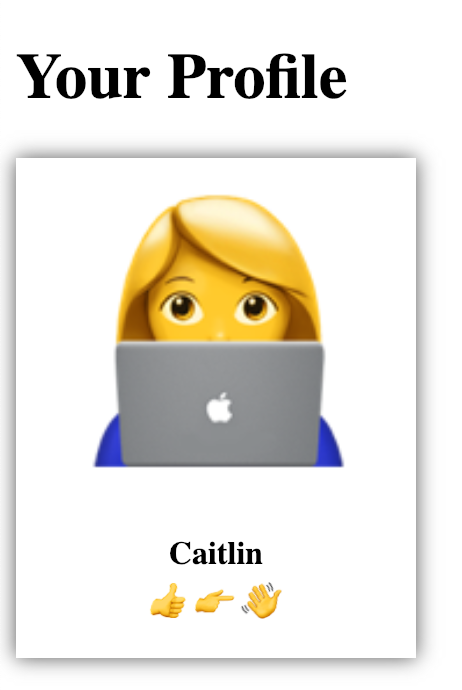

# Getting Started with React

This repo is a space for my learning about react. I have started with hello world and am building from there.

#### Practice Includes
* Using ReactDOM.render(what, where);
* Using functional stateless components
* Using class components
* Styling React components with CSS
* Complex components
* Making a profile page for a social media app called FriendLY. Looks like this:

